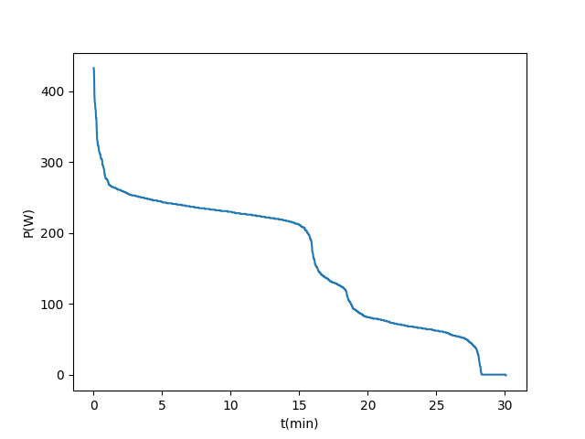

# programmieren_2_aufgabe_1
This repository is used for exercise 1 of the programming lecture. 

''''
Vorgehen:
1. uv runterladen und im terminal überprüfen
2. runterladen der notwendigen Dateien (activity.csv, load_data.py)
3. jetzt können die Daten in VS-Code importiert werden und das Projekt kann begonnen werden

Projektstruktur:
main.py - Hauptskript, hier wird alles zusammengefügt
load_data.py - Lädt die CSV-Datei und gibt die Spalten als Dictionary zurück
sort.py - Enthält Bubble Sort Implementierung 
          in der Datei wird der Abschnitt if __name__ == "__main__": genutzt, um die zuvor geschriebene Definition mit imaginären Daten zu überprüfen
power_curve.py - Visualisiert die Daten bzw. erstellt den Plot der Power Curve mit matplolib
activity.csv - Die Eingabedaten (Aktivitätsdaten mit Leistungswerten)
figures/ - Hier landen die generierte Grafiken

Setup
Das Projekt verwendet UV als Package Manager. Python => 3.12 wird benötigt.
uv install 

Ausführung
Einfach das main.py skript starten:
uv run python main.py
oder direkt mit dem venv:
python main.py

Abhängigkeiten
numpy
matplotlib

Autoren:
Clara Kerber
Luisa Grimm